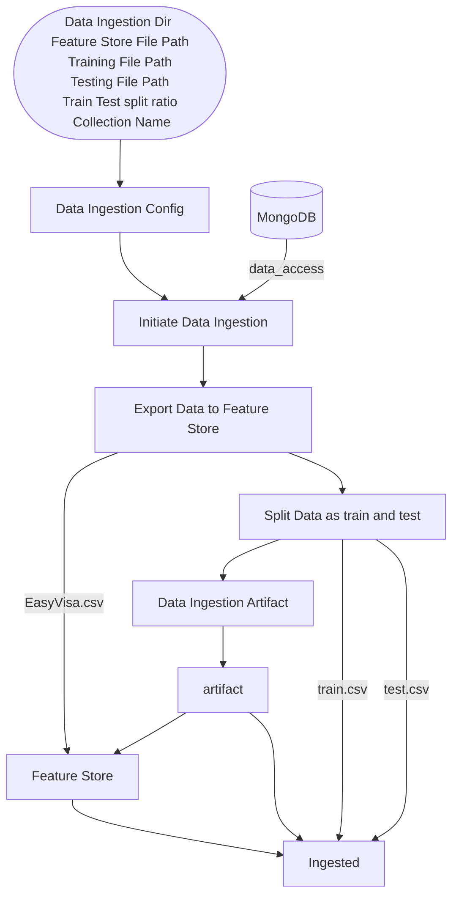

<div align="center">
<h1>Machine Learning Project Implementation</h1>
</div>

# **Context**
- [**Context**](#context)
  - [**Day 01 - Project Introduction \& Setup**](#day-01---project-introduction--setup)
    - [Project: US Visa Approval Prediction](#project-us-visa-approval-prediction)
    - [Requirements](#requirements)
    - [Project Overview](#project-overview)
    - [Deployment](#deployment)
    - [Problem Statement](#problem-statement)
    - [Features](#features)
    - [Solution Scope](#solution-scope)
    - [Solution Approach](#solution-approach)
    - [Solution Proposed](#solution-proposed)
    - [Project Setup](#project-setup)
      - [Environment Setup](#environment-setup)
      - [Project Structure](#project-structure)
      - [Project Structure Template](#project-structure-template)
      - [Requirements.txt \& setup.py](#requirementstxt--setuppy)
  - [**Day 02 - Database Setup \& Project Utility**](#day-02---database-setup--project-utility)
    - [Agenda](#agenda)
    - [Database Setup](#database-setup)
      - [MongoDB settings](#mongodb-settings)
      - [Insert Data to MongoDB](#insert-data-to-mongodb)
      - [Ingest Data from MongoDB](#ingest-data-from-mongodb)
    - [Project Utility](#project-utility)
      - [Logging Functionality](#logging-functionality)
      - [Exception handling](#exception-handling)
      - [Utility functions / Commonly used functions](#utility-functions--commonly-used-functions)
  - [**Day 03 - EDA, FE \& Model Training**](#day-03---eda-fe--model-training)
    - [Exploratory Data Analysis (EDA)](#exploratory-data-analysis-eda)
      - [Types of Analysis in EDA](#types-of-analysis-in-eda)
      - [Types of Variables in EDA](#types-of-variables-in-eda)
      - [Multicollinearity In EDA](#multicollinearity-in-eda)
    - [Feature Engineering](#feature-engineering)
      - [Feature Extraction](#feature-extraction)
      - [Feature Transform](#feature-transform)
      - [Skewness and Outlier](#skewness-and-outlier)
      - [Column Transformation for Categorical Values](#column-transformation-for-categorical-values)
      - [Handling Imbalanced Data](#handling-imbalanced-data)
    - [Model Training](#model-training)
      - [Train-Test Split](#train-test-split)
      - [List of Models](#list-of-models)
      - [Hyperparameter Tuning](#hyperparameter-tuning)
      - [Final Report](#final-report)
  - [**Day 04 - Project Documentation \& Project Management**](#day-04---project-documentation--project-management)
    - [Project Documentation](#project-documentation)
      - [Wireframe](#wireframe)
      - [HLD - High Level Design](#hld---high-level-design)
      - [LLD - Low Level Design](#lld---low-level-design)
    - [Project Management](#project-management)
      - [Jira](#jira)
      - [Agile Project Management](#agile-project-management)
      - [Work Types in Agile Boards](#work-types-in-agile-boards)
      - [Work Types Visualize](#work-types-visualize)
  - [**Day 05 - Data Ingestion Component Implementation**](#day-05---data-ingestion-component-implementation)
    - [ML Linear Pipeline](#ml-linear-pipeline)
    - [Data Ingestion Flowchart](#data-ingestion-flowchart)
      - [Data Ingestion Config](#data-ingestion-config)
      - [Database (MongoDB)](#database-mongodb)
      - [Initiate Data Ingestion](#initiate-data-ingestion)
      - [Export Data to Feature Store](#export-data-to-feature-store)
      - [Split Data as Train and Test](#split-data-as-train-and-test)
      - [Data Ingestion Artifact](#data-ingestion-artifact)
      - [Feature Store](#feature-store)
      - [Output Files](#output-files)
    - [Workflow](#workflow)
  - [**Day 06 - Data Drift with Evidently \& Data Validation**](#day-06---data-drift-with-evidently--data-validation)
    - [Data Drift](#data-drift)
    - [Data Drift Detection Demo using Evidently](#data-drift-detection-demo-using-evidently)
    - [Data Drift Detection on Visa Data](#data-drift-detection-on-visa-data)
    - [Data Validation Component](#data-validation-component)

## **Day 01 - Project Introduction & Setup**

### Project: US Visa Approval Prediction

### Requirements

- [Anaconda](https://www.anaconda.com/download)
- [Git](https://git-scm.com/downloads)
- [VsCode](https://code.visualstudio.com/)

[⬆️ Go to Context](#context)

### Project Overview

- Understanding the Problem Statement
- Understanding the solution
- Code understanding & walkthrough
- Understanding the Deployment

[⬆️ Go to Context](#context)

### Deployment

- Docker
- Cloud Services
- Adding self-hosted runner
- workflows

[⬆️ Go to Context](#context)

### Problem Statement

- US visa approval status
- Given certain set of feature such as continent, education, job_experience, training, employment, current age etc.
- We have to predict weather the application for the visa will be approved or not.

[⬆️ Go to Context](#context)

### Features

- Continent: `Asia`, `Africa`, `North America`, `Europe`, `South America`, `Oceania`
- Eduction: `High School`, `Master's Degree`, `Bachelor's`, `Doctorate`
- Job Experience: `Yes`, `No`
- Required training: `Yes`, `No`
- Number of employees: `15000` to `40000`
- Region of employment: `West`, `Northeast`, `South`, `Midwest`, `Island`
- Prevailing wage: `700` to `70000`
- Contract Tenure: `Hour`, `Year`, `Week`, `Month`
- Full-time: `Yes`, `No`
- Age of company: `15` to `180`

[⬆️ Go to Context](#context)

### Solution Scope

- This can be used on real life by US visa applicants so that they can improve their resume and criteria for the approval process.

[⬆️ Go to Context](#context)

### Solution Approach

- Machine Learning : ML Classification Algorithms
- Deep Learning: Custom ANN with sigmoid activation Function

[⬆️ Go to Context](#context)

### Solution Proposed

> We will be using ML (Machine Learning)

- Load the data from DB
- Perform EDA and feature engineering to select the desirable features.
- Fit the ML classification Algorithm and find out which one performs better.
- Select top few and tune hyperparameters.
- Select the best model based on desired metrics

[⬆️ Go to Context](#context)

### Project Setup

- GitHub Repository
- Requirements
- Template
- Database
  - [MongoDB](https://www.mongodb.com/)
  - Alternative options: [PostgreSQL](https://www.postgresql.org/), [MySQL](https://www.mysql.com/)

[⬆️ Go to Context](#context)

#### Environment Setup

- Create conda `venv`

  ```sh
  conda create python -p venv
  ```

- Activate `venv`

  ```sh
  conda activate ./venv
  ```

> [!NOTE]
>
> - I use the `-p` (path) option instead of -`n` (name) when creating environments.
> - The -`n` flag assigns a **name** to the environment, and conda stores it inside the default directory, e.g., `C:\...\envs\venv`.
> - The `-p` flag specifies the **path** where the environment should be created.
> - Since I provided only a relative path name (`venv`) with `-p`, conda created the environment in the current working directory.
> - And for activating I have to gave full path but the shortcut is using relative path `./venv`

[⬆️ Go to Context](#context)

#### Project Structure

  ```sh
  ├── 📁 Root Path
  ├── 📁 documents/
  │   └── 📄 .gitkeep
  ├── 📁 US Visa Approval Prediction/
  │   ├── 📁 components/
  │   │   ├── 🐍 __init__.py
  │   │   ├── 🐍 data_ingestion.py
  │   │   ├── 🐍 data_transformation.py
  │   │   ├── 🐍 data_validation.py
  │   │   ├── 🐍 model_evaluation.py
  │   │   ├── 🐍 model_pusher.py
  │   │   └── 🐍 model_trainer.py
  │   ├── 📁 config/
  │   │   ├── ⚙️ model.yaml
  │   │   └── ⚙️ schema.yaml
  │   ├── 📁 configuration/
  │   │   ├── 🐍 __init__.py
  │   │   └── 🐍 db_connection.py
  │   ├── 📁 constants/
  │   │   └── 🐍 __init__.py
  │   ├── 📁 data/
  │   │   ├── 📁 interim/
  │   │   │   └── 📄 .gitkeep
  │   │   ├── 📁 processed/
  │   │   │   └── 📄 .gitkeep
  │   │   └── 📁 raw/
  │   │        └── 📄 .gitkeep
  │   ├── 📁 data_access/
  │   │   ├── 🐍 __init__.py
  │   │   └── 🐍 data.py
  │   ├── 📁 entity/
  │   │   ├── 🐍 __init__.py
  │   │   ├── 🐍 artifact_entity.py
  │   │   └── 🐍 config_entity.py
  │   ├── 📁 logger/
  │   │   └── 🐍 __init__.py
  │   ├── 📁 notebooks/
  │   │   ├── 📓 01_exploration.ipynb
  │   │   ├── 📓 02_eda.ipynb
  │   │   └── 📓 03_feature_engineering_and_model_training.ipynb
  │   ├── 📁 pipeline/
  │   │   ├── 🐍 __init__.py
  │   │   ├── 🐍 prediction_pipeline.py
  │   │   └── 🐍 training_pipeline.py
  │   ├── 📁 tests/
  │   │   ├── 🐍 __init__.py
  │   │   ├── 🐍 test_data_ingestion.py
  │   │   ├── 🐍 test_data_transformation.py
  │   │   ├── 🐍 test_db_connection.py
  │   │   ├── 🐍 test_model_trainer.py
  │   │   └── 🐍 test_training_pipeline.py
  │   ├── 📁 utils/
  │   │   ├── 🐍 __init__.py
  │   │   └── 🐍 main_utils.py
  │   └── 🐍 __init__.py
  ├── 📄 .dockerignore
  ├── 🔒 .env
  ├── 🚫 .gitignore
  ├── 📄 .python-version
  ├── 🐳 Dockerfile
  ├── 📖 README.md
  ├── 🐍 app.py
  ├── 🐍 demo.py
  ├── 📄 requirements.txt
  ├── 🐍 setup.py
  └── 🐍 template.py
  ```

[⬆️ Go to Context](#context)

#### Project Structure Template

- Run [template.py](template.py)

  ```py
  py template.py
  ```

- It will generate [Project Structure](#project-structure) files/folders automatically

[⬆️ Go to Context](#context)

#### Requirements.txt & setup.py

- Update [requirements.txt](./US%20Visa%20Approval%20Prediction/requirements.txt) by adding the following dependencies

  ```txt
  boto3==1.40.16
  catboost==1.2.8
  dill==0.4.0
  evidently==0.7.14
  fastapi==0.116.1
  from-root==1.3.0
  httptools==0.6.4
  imbalanced-learn==0.14.0
  Jinja2==3.1.6
  mypy-boto3-s3==1.40.0
  neuro-mf==0.0.5
  pyarrow==21.0.0
  pymongo==4.14.1
  python-dotenv==1.1.1
  python-multipart==0.0.20
  seaborn==0.13.2
  watchfiles==1.1.0
  websockets==15.0.1
  xgboost==3.0.4
  ```

- Now to use folder as module we have added `__init__.py` (*[template.py](template.py) added that while creating all files/folders*)
- Now using [setup.py](./US%20Visa%20Approval%20Prediction/setup.py) we configure the project so that any folder with `__init__.py` file is treated as a package

  ```py
  from setuptools import setup, find_packages

  setup(
      name="us_visa_approval_prediction",
      version="0.0.1",
      author="Tansen",
      author_email="aatansen@gmail.com",
      packages=find_packages()
  )
  ```

- Now add this at the end of the [requirements.txt](./US%20Visa%20Approval%20Prediction/requirements.txt)

  ```sh
  -e .
  ```

- Now run this command to install all dependencies

  ```sh
  pip install -r requirements.txt
  ```

[⬆️ Go to Context](#context)

## **Day 02 - Database Setup & Project Utility**

- **Notebook**: [01_exploration_and_db_setup.ipynb](./us_visa_approval_prediction/notebooks/01_exploration_and_db_setup.ipynb) inside [notebooks](./us_visa_approval_prediction/notebooks/)

### Agenda

- Database setup (MongoDB Atlas)
- Logging Module
- Exception Module
- Utility Module

[⬆️ Go to Context](#context)

### Database Setup

- Create [MongoDB Account](https://account.mongodb.com/account/register)
- Create New project
- Create cluster and database user
- Get driver code of relevant python version (*I used Stable API:  `3.12 or later`*)
- Get the dataset from Kaggle: [EasyVisa_Dataset](https://www.kaggle.com/datasets/moro23/easyvisa-dataset)
- Using pandas to load the data and do some preprocessing & others check in notebook [exploration.ipynb](./US%20Visa%20Approval%20Prediction/notebooks/exploration.ipynb)
- To save data in MongoDB we have to convert the data into dictionary

  ```py
  data=df.to_dict(orient='records')
  ```

[⬆️ Go to Context](#context)

#### MongoDB settings

- Add Config in [.env](/.env)

  ```py
  # Get values from environment
  DB_NAME = os.getenv("DB_NAME")
  COLLECTION_NAME = os.getenv("COLLECTION_NAME")
  CONNECTION_URL = os.getenv("CONNECTION_URL")
  ```

- Insert the converted dictionary data in MongoDB

  ```py
  import pymongo
  client = pymongo.MongoClient(CONNECTION_URL)
  data_base = client[DB_NAME]
  collection = data_base[COLLECTION_NAME]
  ```

[⬆️ Go to Context](#context)

#### Insert Data to MongoDB

- Insert data

  ```py
  records = collection.insert_many(data)
  ```

- If data insert failed due to `timeout error` use `certifi`

  ```py
  import certifi
  client = pymongo.MongoClient(CONNECTION_URL,tlsCAFile=certifi.where())
  ```

  > [!NOTE]
  >
  > As I am using latest version and I did not get any error related to `timeout`
  >
  > If still error persists use different stable version of `pymongo` (e.g: `pymongo>=4.7`)

[⬆️ Go to Context](#context)

#### Ingest Data from MongoDB

- Ingest data

  ```py
  records = collection.find().limit(5)
  for i,j in enumerate(records):
    print(f"{i}: {j}")
  ```

  > [!NOTE]
  > In the notebook we can see records output is `cursor object`.
  >
  > A `cursor object` is a `forward-only`, `lazy-loading` iterator returned by `MongoDB` queries (like `find()`), which acts as a pointer to the query results on the server and streams documents in batches until exhausted.It Exhausted after full iteration. Can be converted to list with list(cursor). More memory-efficient than lists. Requires new query to reuse.

- Cursor Object to DataFrame

  ```py
  df = pd.DataFrame(list(collection.find()))
  ```

- Dropping `MongoDB`'s `_id` from column

  ```py
  if '_id' in df.columns.to_list():
      df.drop(columns=['_id'], inplace=True)
  df.head()
  ```

[⬆️ Go to Context](#context)

### Project Utility

- Logging functionality
- Exception handling
- Utility functions / Commonly used functions (e.g: YAML file read in any places)

[⬆️ Go to Context](#context)

#### Logging Functionality

- Edit [logger `__init__.py`](./us_visa_approval_prediction/logger/__init__.py) file to save logs
- Test it in [demo.py](./demo.py)

[⬆️ Go to Context](#context)

#### Exception handling

- Edit [exception `__init__.py`](./us_visa_approval_prediction/exception/__init__.py) file to show properly formatted error message by custom exception
- Test it in [demo.py](./demo.py)

[⬆️ Go to Context](#context)

#### Utility functions / Commonly used functions

- Edit utils [main_utils.py](./us_visa_approval_prediction/utils/main_utils.py) here we defined all the commonly used functions

[⬆️ Go to Context](#context)

## **Day 03 - EDA, FE & Model Training**

### Exploratory Data Analysis (EDA)

- **Notebook**: [02_eda_us_visa.ipynb](./us_visa_approval_prediction/notebooks/02_eda_us_visa.ipynb) inside [notebooks](./us_visa_approval_prediction/notebooks/)

[⬆️ Go to Context](#context)

#### Types of Analysis in EDA

- Univariate Analysis
  - “What does this single column look like?”
  - Look at one feature alone → Age distribution, Visa approval %

- Bivariate Analysis
  - “How does one column affect another?”
  - Look at two features together → Age vs Visa Status
- Multivariate Analysis
  - “How do many columns work together?”
  - Look at many features together → Age + Education + Country → Visa Status

[⬆️ Go to Context](#context)

#### Types of Variables in EDA

- Discrete Variables
  - “Countable steps or categories”
  - Whole numbers, few unique values → Visa Status (Approved/Denied), Education (Bachelor/Master/PhD)

- Continuous Variables
  - “Smooth measurements, can take decimals”
  - Measured values, many unique values → Age, Income, Years of Experience

More Variables:

- Categorical Variables
  - Represent categories or labels, not numbers
  - Can be nominal (no order) or ordinal (ordered)
  - Examples: Country, Gender, Education Level

- Binary Variables
  - Special case of categorical variables with only two categories
  - Examples: Yes/No, True/False, Approved/Denied

- Date/Time Variables
  - Represent time-related information, can be transformed into numeric features
  - Examples: Application Date, Visa Issue Date

- Text Variables
  - Unstructured textual data, can be converted into features using NLP techniques
  - Examples: Job Description, Applicant Remarks

[⬆️ Go to Context](#context)

#### Multicollinearity In EDA

- Definition
  - “When two or more independent variables are highly correlated with each other”
  - Means they provide duplicate information instead of unique insight

- Why It Matters
  - Makes it hard to understand which feature actually influences the target
  - Can cause instability in regression models

- Detection Methods (Numeric)
  - Correlation heatmap → Check if correlation > 0.8 or < -0.8 between features
  - Variance Inflation Factor (VIF) → VIF > 10 usually indicates high multicollinearity

- Detection Methods (Categorical)
  - Cramér’s V → Measures strength of association between two categorical variables (0–1 scale)
  - Chi-square (χ²) Test → Low p-value (<0.05) indicates dependence between categorical variables

[⬆️ Go to Context](#context)

### Feature Engineering

- **Notebook**: [03_feature_engineering_and_model_training.ipynb](./us_visa_approval_prediction/notebooks/03_feature_engineering_and_model_training.ipynb) inside [notebooks](./us_visa_approval_prediction/notebooks/)

- **Definition:**
  Feature Engineering is the process of creating, transforming, or selecting features (variables) from raw data to improve the performance of machine learning models. It helps the model better capture patterns, relationships, and trends in the data.

- **Key Objectives:**
  - Make raw data more suitable for modeling
  - Handle missing values, outliers, and skewed distributions
  - Transform categorical variables into numerical formats
  - Create new features that capture important patterns or relationships

- **Common Techniques:**
  - **Feature Extraction:** Creating new features from existing data (e.g., extracting year from a date, calculating ratios)
  - **Feature Transformation:** Scaling, normalizing, or transforming features (e.g., log transform, Yeo-Johnson transform)
  - **Feature Encoding:** Converting categorical variables to numeric (Label Encoding, Ordinal Encoding, One-Hot Encoding)
  - **Handling Imbalanced Data:** Techniques like SMOTE to balance classes

[⬆️ Go to Context](#context)

#### Feature Extraction

- Creating new features from existing data to capture important patterns
- Examples:
  - Extracting "year" and "month" from a datetime column
  - Counting number of previous visa applications per applicant
  - Generating ratios, differences, or aggregations from numeric features

[⬆️ Go to Context](#context)

#### Feature Transform

- Transforming features to improve distribution, handle outliers, or scale data
- Examples:
  - Log transformation → reduces right skew
  - Yeo-Johnson transformation → handles skewness and outliers for positive and negative values
  - Standardization (z-score) → mean=0, std=1
  - Min-Max scaling → scales features to [0,1] range

[⬆️ Go to Context](#context)

#### Skewness and Outlier

- Skewness refers to a distortion or asymmetry that deviates from a normal distribution (bell curve)
- Positive (right) skew → tail on the right, mean > median, may indicate extreme high values (outliers)
- Negative (left) skew → tail on the left, mean < median, may indicate extreme low values (outliers)
- A normal distribution has skewness = 0
- Skewed columns (e.g., number of employees, company age) may need transformation
- Power transforms (Box-Cox or Yeo-Johnson) can make skewed data more Gaussian-like
- Useful for addressing heteroscedasticity or modeling assumptions where normality is desired
- Skewness can act as a **red flag for potential outliers**, but visual confirmation with boxplots or histograms is recommended

[⬆️ Go to Context](#context)

#### Column Transformation for Categorical Values

- In machine learning, categorical variables need to be converted into numeric format for models to process them effectively.

- **Label Encoding**
  - Assigns a unique integer to each category
  - Suitable when no ordinal relationship exists, but watch out: it may imply a false ordering
  - Example:

    ```py
    Colors = ['Red', 'Green', 'Blue', 'Red', 'Green']
    LabelEncoder → [2, 1, 0, 2, 1]
    ```

  - Pros: Simple, compact representation
  - Cons: Implies ordinal relationship which may not exist

  - **Ordinal Encoding**
    - Preserves an explicit order among categories
    - Suitable for ordinal variables like education level, rating, or size
    - Example:

      ```py
      Education = ['High School', 'Bachelor', 'Master', 'Ph.D.']
      OrdinalEncoder → [[0], [1], [2], [3]]
      ```

    - Pros: Maintains order information
    - Cons: Assumes linear order; may not capture non-linear relationships

  - **One-Hot Encoding**
    - Converts each category into a binary vector (1 for presence, 0 for absence)
    - Avoids introducing ordinal relationships
    - Example:

      ```py
      Fruit = ['Apple', 'Banana', 'Orange', 'Apple', 'Banana']
      pd.get_dummies →
         Fruit_Apple  Fruit_Banana  Fruit_Orange
         1            0             0
         0            1             0
         0            0             1
         1            0             0
         0            1             0
      ```

    - Pros: No false ordinal relationships
    - Cons: Can lead to high-dimensional feature space with many categories

  - **Conclusion**
    - Choose encoding based on data type and model requirements:
      - Label Encoding → simple, may imply order
      - Ordinal Encoding → preserves natural order
      - One-Hot Encoding → avoids order but increases dimensions

[⬆️ Go to Context](#context)

#### Handling Imbalanced Data

- Imbalanced datasets occur when one class has significantly more samples than another, which can bias model training.

- **Upsampling (Over-sampling)**
  - Increase the number of samples in the minority class by **duplicating existing samples** or creating synthetic ones
  - Example: If class A has 1000 samples and class B has 100, duplicate class B samples to reach 1000

- **Downsampling (Under-sampling)**
  - Reduce the number of samples in the majority class to match the minority class
  - Example: If class A has 1000 samples and class B has 100, randomly remove samples from class A to reach 100

- **SMOTE (Synthetic Minority Over-sampling Technique)**
  - Generates synthetic samples for the minority class to balance the dataset
  - Works by creating new instances along the line segments between existing minority samples
  - Helps improve model performance on minority class predictions
  - Example usage:

    ```py
    from imblearn.over_sampling import SMOTE

    smote = SMOTE()
    X_resampled, y_resampled = smote.fit_resample(X, y)
    ```

- Other techniques:
  - Undersampling the majority class
  - Combining over- and under-sampling
  - Using class-weighted algorithms

[⬆️ Go to Context](#context)

### Model Training

- **Notebook**: [03_feature_engineering_and_model_training.ipynb](./us_visa_approval_prediction/notebooks/03_feature_engineering_and_model_training.ipynb) inside [notebooks](./us_visa_approval_prediction/notebooks/)

#### Train-Test Split

- Before training models, the dataset is split into **training set** and **testing set**
  - Training set → used to train the model
  - Testing set → used to evaluate model performance on unseen data
- Common split ratio: 70:30 or 80:20

[⬆️ Go to Context](#context)

#### List of Models

- Multiple models are trained to compare their performance on the dataset.
  - **Random Forest Classifier** → ensemble of decision trees, good for handling non-linear relationships
  - **Decision Tree Classifier** → simple interpretable tree-based model
  - **Gradient Boosting Classifier** → sequential ensemble boosting method
  - **Logistic Regression** → linear model for binary classification
  - **K-Nearest Neighbors (KNN) Classifier** → distance-based model, predicts based on neighbors
  - **XGBoost Classifier** → efficient gradient boosting implementation
  - **CatBoost Classifier** → gradient boosting with categorical feature support
  - **Support Vector Classifier (SVC)** → finds optimal hyperplane to separate classes
  - **AdaBoost Classifier** → ensemble boosting using weighted trees

- **Initial Model Results:**

  | Model Name                | Accuracy |
  | ------------------------- | -------- |
  | Random Forest             | 0.9528   |
  | K-Neighbors Classifier    | 0.9416   |
  | XGBClassifier             | 0.9352   |
  | Decision Tree             | 0.9269   |
  | CatBoosting Classifier    | 0.9261   |
  | Gradient Boosting         | 0.8791   |
  | Support Vector Classifier | 0.8571   |
  | AdaBoost Classifier       | 0.8492   |
  | Logistic Regression       | 0.7256   |

#### Hyperparameter Tuning

- Process of fine-tuning model parameters to improve performance
- Focus on the top-performing models: K-Nearest Neighbors, Random Forest, and XGBClassifier
- Retrain these models using their best-found parameters to maximize accuracy and generalization

- **Tuned Results:**

  | Model Name               | Accuracy |
  | ------------------------ | -------- |
  | KNeighborsClassifier     | 0.9683   |
  | Random Forest Classifier | 0.9528   |
  | XGBClassifier            | 0.9457   |

[⬆️ Go to Context](#context)

#### Final Report

- **Best Model:** K-Nearest Neighbors (KNN)
- **Accuracy:** 96.83%

[⬆️ Go to Context](#context)

## **Day 04 - Project Documentation & Project Management**

### Project Documentation

#### Wireframe

- A wireframe is a basic, low-fidelity visual representation of a digital product’s layout.
- Focuses on structure and functionality, not final design.

  > US Visa Approval Prediction Wireframe is located inside [documents](./documents/) directory [01_Wireframe.md](./documents/01_Wireframe.md)

[⬆️ Go to Context](#context)

#### HLD - High Level Design

- Describes the system architecture and major components.
- Provides an overview of modules, data flow, and interactions.
- Used to understand the big picture before diving into details.

  > US Visa Approval Prediction HLD is located inside [documents](./documents/) directory [02_HLD.md](./documents/02_HLD.md)

[⬆️ Go to Context](#context)

#### LLD - Low Level Design

- Provides detailed design of each component/module.
- Specifies logic, database schema, APIs, and algorithms.
- Acts as a blueprint for developers to implement the system.

  > US Visa Approval Prediction LLD is located inside [documents](./documents/) directory [03_LLD.md](./documents/03_LLD.md)

[⬆️ Go to Context](#context)

### Project Management

#### Jira

- [Jira by Atlassian](https://www.atlassian.com/software/jira)
- Project management involves planning, organizing, and monitoring a project to achieve specific goals on time and within budget.

[⬆️ Go to Context](#context)

#### Agile Project Management

- Agile is an iterative approach to project management and software development.
- Focuses on flexibility, collaboration, and delivering small, incremental improvements.
- Uses short cycles called **sprints** to complete tasks and review progress regularly.
- Key principles include customer collaboration, adaptive planning, and continuous improvement.
- **Scrum** is a popular framework within Agile that provides structure through defined roles, events, and artifacts to implement Agile principles effectively.
- **Kanban Board** is another Agile tool used to visualize work, limit work in progress, and optimize flow.
  - Tasks are represented as cards on a board with columns like *To Do*, *In Progress*, and *Done*.
  - Helps teams see bottlenecks, prioritize tasks, and improve efficiency.
  - Unlike Scrum, Kanban is continuous and does not require fixed-length sprints.

- Key steps in project management:

  1. **Initiation**
     - Define project scope, objectives, and stakeholders.
     - Identify feasibility, risks, and resources required.

  2. **Planning**
     - Create a detailed project plan with tasks, timelines, and milestones.
     - Assign responsibilities and allocate resources.
     - Identify dependencies and risks.

  3. **Execution**
     - Carry out the project plan by developing deliverables.
     - Track progress and ensure team collaboration.
     - Communicate updates to stakeholders.

  4. **Monitoring & Controlling**
     - Track performance against the plan (time, cost, quality).
     - Manage changes, risks, and issues.
     - Ensure project stays on track and meets objectives.

  5. **Closure**
     - Deliver the final product or service.
     - Conduct project review and document lessons learned.
     - Release resources and formally close the project.

- Jira Alternative
  - [Trello](https://trello.com/)
  - [Asana](https://asana.com/)
  - [ClickUp](https://clickup.com/)
  - [Microsoft Project](https://www.microsoft.com/en-us/microsoft-365/p/project-professional-2024/cfq7ttc0ph40)

[⬆️ Go to Context](#context)

#### Work Types in Agile Boards

Big abstract View of Work which then gets broken down in several smaller Tasks called User Stories. Work items are categorized into different types to organize and track progress effectively:

- **Epic**
  - Represents a large body of work that can be broken down into multiple stories or tasks.
  - Often spans multiple sprints or releases.
  - Used to capture high-level features or initiatives.

- **Story**
  - Represents a user-focused feature or requirement.
  - Typically fits within a single sprint.
  - Written from the user perspective, e.g., “As a user, I want to … so that …”.

- **Task**
  - Actual Tasks that have to be completed by your Team for the
  success of the User Story.
  - A smaller, actionable unit of work, often part of a story or epic.
  - Represents work that a team member can complete within a sprint.
  - Focused on implementation details or development work.

- **Bug**
  - Represents a defect or issue in the product that needs fixing.
  - Can be prioritized and assigned like tasks or stories.
  - Helps track software quality and ensure issues are resolved promptly.

[⬆️ Go to Context](#context)

#### Work Types Visualize

  ```mermaid
  graph LR
      Epic["Epic: User Authentication"]

      Story1["Story: User Login"]
      Story2["Story: User Registration"]

      Task1["Task: Design login UI"]
      Task2["Task: Implement login API"]
      Bug1["Bug: Login button not clickable"]

      Task3["Task: Design registration UI"]
      Task4["Task: Implement registration API"]
      Bug2["Bug: Email validation fails"]

      Epic --> Story1
      Epic --> Story2

      Story1 --> Task1
      Story1 --> Task2
      Story1 --- Bug1

      Story2 --> Task3
      Story2 --> Task4
    Story2 --- Bug2
  ```

[⬆️ Go to Context](#context)

## **Day 05 - Data Ingestion Component Implementation**

### ML Linear Pipeline

- Linear Pipeline
  - Data Ingestion
  - Data validation
  - Data transformation
  - Model training
  - Model Evaluation
  - Model Pusher

- For Flowchart Diagram
  - [Whimsical](https://whimsical.com/)

[⬆️ Go to Context](#context)

### Data Ingestion Flowchart



[⬆️ Go to Context](#context)

#### Data Ingestion Config

- Data Ingestion Directory
- Feature Store File Path
- Training File Path
- Testing File Path
- Train-Test Split Ratio
- Collection Name

[⬆️ Go to Context](#context)

#### Database (MongoDB)

- Source of raw data
- Provides data via `data_access`
- Connects directly to Initiate Data Ingestion

[⬆️ Go to Context](#context)

#### Initiate Data Ingestion

- Starts ingestion process
- Pulls data from MongoDB

[⬆️ Go to Context](#context)

#### Export Data to Feature Store

- Exports ingested data into feature store
- Saves data as CSV (usvisa.csv)
- Maintains raw version in Feature Store

[⬆️ Go to Context](#context)

#### Split Data as Train and Test

- Splits dataset into train.csv and test.csv
- Ensures ratio defined in config
- Outputs Data Ingestion Artifact

[⬆️ Go to Context](#context)

#### Data Ingestion Artifact

- Stores generated artifacts
- Includes split datasets and metadata

[⬆️ Go to Context](#context)

#### Feature Store

- Repository for ingested and processed data
- Holds CSV file (usvisa.csv)
- Maintains Ingested + Artifact directories

[⬆️ Go to Context](#context)

#### Output Files

- `usvisa.csv` → raw data exported to Feature Store
- `train.csv` → training dataset
- `test.csv` → testing dataset
- `artifact/` → metadata and artifacts
- `ingested/` → ingested dataset ready for next pipeline step

[⬆️ Go to Context](#context)

### Workflow

- Update those in order

  1. [constants](./us_visa_approval_prediction/constants/__init__.py)
  2. [entity](./us_visa_approval_prediction/entity/)
     1. [config_entity](./us_visa_approval_prediction/entity/config_entity.py)
     2. [artifact_entity](./us_visa_approval_prediction/entity/artifact_entity.py)
  3. [configuration](./us_visa_approval_prediction/configuration/__init__.py)
     1. [db_connection](./us_visa_approval_prediction/configuration/db_connection.py)
     2. [test_db_connection](./us_visa_approval_prediction/tests/test_db_connection.py)
  4. [data_access](./us_visa_approval_prediction/data_access/)
     1. [data](./us_visa_approval_prediction/data_access/data.py)
  5. [components](./us_visa_approval_prediction/components/)
     1. [data_ingestion](./us_visa_approval_prediction/components/data_ingestion.py)
  6. [pipeline](./us_visa_approval_prediction/pipeline/)
     1. [training_pipeline](./us_visa_approval_prediction/pipeline/training_pipeline.py)
     2. [test_training_pipeline](./us_visa_approval_prediction/tests/test_training_pipeline.py)

> [!NOTE]
>
> - Check [logs](./logs/) for any errors
>
> - If everything done properly it will generate artifact directory with timestamp and data after running [test_training_pipeline](./us_visa_approval_prediction/tests/test_training_pipeline.py).

```sh
📁 artifact
└── 📁 09_02_2025_22_59_42/
    └── 📁 data_ingestion/
        ├── 📁 feature_store/
        │   └── 📄 usvisa.csv
        └── 📁 ingested/
            ├── 📄 test.csv
            └── 📄 train.csv
```

[⬆️ Go to Context](#context)

## **Day 06 - Data Drift with Evidently & Data Validation**

### Data Drift

- **Population** = All data (e.g., all visa applications).

- **Sample** = Small part of the population we study.

- **Training data** = Sample to teach the model.

- **Test data** = Sample to check the model.

- **Assumption** = Future data will look like training/test data.

- **Data Drift** = When new real-world data is **different** from training/test data.

**Types of Drift**:

- **Covariate Drift** → Inputs change.
  - Ex: Earlier applicants were mostly students, now most are working professionals.
- **Prior Probability Drift** → Target distribution changes.
  - Ex: Approvals drop from 70% to 40%.
- **Concept Drift** → Input-output relationship changes.
  - Ex: Income mattered before, now job type matters more.

**How to detect**:

- Compare stats (mean, variance, histograms).
- Use statistical tests (KS test, Chi-square, PSI).
- Train a model to separate “old vs. new data.” If it succeeds → drift exists.
- Using Evidently, a MLOps tool to detect data drift easily
  - [ML in Production Guide - Data Drift by Evidently](https://www.evidentlyai.com/ml-in-production/data-drift)
  - [Data Drift Preset by Evidently](https://docs.evidentlyai.com/metrics/preset_data_drift)
  - [Evidently Github Repository](https://github.com/evidentlyai/evidently)

### Data Drift Detection Demo using Evidently

- This demo usage [Boston Housing Dataset](https://github.com/selva86/datasets/blob/master/BostonHousing.csv?raw=True)
- **Notebook**: [04_evidently_data_drift_detection_boston_data.ipynb](./us_visa_approval_prediction/notebooks/04_evidently_data_drift_detection_boston_data.ipynb) inside [notebooks](./us_visa_approval_prediction/notebooks/)
- Based on this demo we will implement evidently in our project

> [!WARNING]
>
> - A warning while runnning the report `divide by zero encountered in divide` and found this
> - The `RuntimeWarning`: `divide by zero` encountered in divide is a common occurrence in statistical computations, especially when dealing with data that may contain zero values.

[⬆️ Go to Context](#context)

### Data Drift Detection on Visa Data

- **Notebook**: [05_evidently_data_drift_detection_visa_data.ipynb](./us_visa_approval_prediction/notebooks/05_evidently_data_drift_detection_visa_data.ipynb) inside [notebooks](./us_visa_approval_prediction/notebooks/)

[⬆️ Go to Context](#context)

### Data Validation Component

- FlowChart

  ```mermaid
  flowchart TD
      %% Config and Initiation
      Note1(["Data validation dir &#xA Valid data dir &#xA Invalid data dir &#xA Valid train file path &#xA Valid train file path &#xA Invalid test file path &#xA Drift report file path"])
      Note1 --> A
      A[Data Validation Config] --> B[Initiate Data Validation]
      B --> C[Read Data]

      %% Data Ingestion
      C --> D[Validate number of Columns]
      C --> E[Data Ingestion Artifact]
      E --> F[train.csv]
      E --> G[test.csv]

      %% Column validation checks
      D --> H[Is numerical columns exist?]
      D --> I[Is categorical columns exist?]

      %% Train/Test numerical checks
      H --> J[Train Status]
      H --> K[Test Status]
      J --> L{Status}
      K --> M{Status}
      L --False--> N[Columns are missing in training data frame]
      M --False--> O[Columns are missing in testing data frame]

      %% Train/Test categorical checks
      I --> P[Train Status]
      I --> Q[Test Status]
      P --> R{Status}
      Q --> S{Status}
      R --False--> T[Categorical columns are missing in training data frame]
      S --False--> U[Categorical columns are missing in testing data frame]

      %% Validation status
      L --> V[Validation Status]
      M --> V
      R --> V
      S --> V
      V --False--> W[Validation Error]
      V --True--> X[Detect Dataset Drift]

      %% Drift status and artifact
      X --> Y{Drift Status}
      Y --False--> Z[Data Validation Artifact]
      Z --> AA[report]

      %% Report details
      Z --> Note2(["validation status &#xA valid train file path &#xA valid test file path &#xA invalid train file path &#xA invalid test file path &#xA drift report file path"])
  ```

- Now update those in order of [Workflow](#workflow)
  - Update [constants](./us_visa_approval_prediction/constants/__init__.py)
  - Update [schema.yaml](./us_visa_approval_prediction/config/schema.yaml) inside [config](./us_visa_approval_prediction/config/)
  - Update [config_entity](./us_visa_approval_prediction/entity/config_entity.py) inside [entity](./us_visa_approval_prediction/entity/)
  - Update [config_entity](./us_visa_approval_prediction/entity/config_entity.py) inside [entity](./us_visa_approval_prediction/entity/)
  - Update [artifact_entity](./us_visa_approval_prediction/entity/artifact_entity.py) inside [entity](./us_visa_approval_prediction/entity/)
  - Update [data_validation](./us_visa_approval_prediction/components/data_validation.py) inside [components](./us_visa_approval_prediction/components/)
  - Update [training_pipeline](./us_visa_approval_prediction/pipeline/training_pipeline.py) inside [pipeline](us_visa_approval_prediction/pipeline/)

> [!NOTE]
>
> - As I use latest version of Evidently AI there are changes in [data_validation](./us_visa_approval_prediction/components/data_validation.py) function `detect_dataset_drift` and library import

[⬆️ Go to Context](#context)
