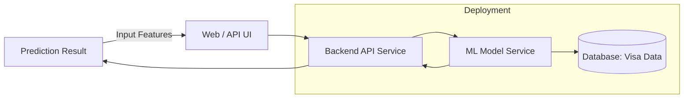
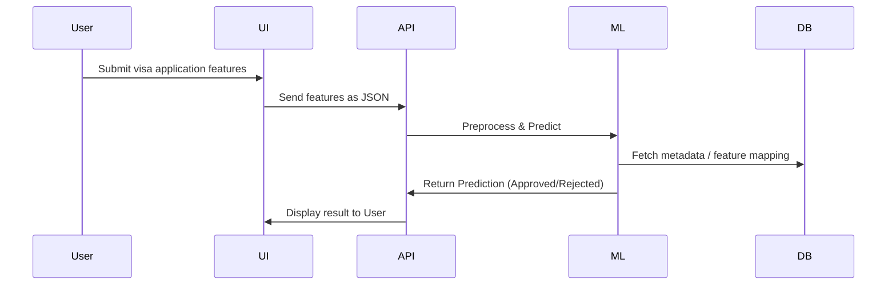

<h1>🏗 High-Level Design (HLD) 🏗</h1>

# **Context**
- [**Context**](#context)
  - [**Project Overview**](#project-overview)
  - [**Version History**](#version-history)
  - [1. **System Context**](#1-system-context)
  - [2. **Architecture Overview**](#2-architecture-overview)
  - [3. **Key Components**](#3-key-components)
    - [**Frontend / User Interface**](#frontend--user-interface)
    - [**Backend Services**](#backend-services)
    - [**Machine Learning Model**](#machine-learning-model)
    - [**Data Layer**](#data-layer)
    - [**Deployment Infrastructure**](#deployment-infrastructure)
  - [4. **Data Flow**](#4-data-flow)
  - [5. **Non-Functional Requirements (NFRs)**](#5-non-functional-requirements-nfrs)
  - [6. **Tech Stack**](#6-tech-stack)

## **Project Overview**

| Field                  | Details                     |
| ---------------------- | --------------------------- |
| **Project Name**       | US Visa Approval Prediction |
| **Prepared By**        | Md. Alahi Almin Tansen      |
| **Revision Number**    | 1.0                         |
| **Last Revision Date** | 02-09-2025                  |

---
[⬆️ Go to Context](#context)

## **Version History**

| Revision | Date       | Changes Made  | Author                 |
| -------- | ---------- | ------------- | ---------------------- |
| 1.0      | 02-09-2025 | Initial Draft | Md. Alahi Almin Tansen |

---
[⬆️ Go to Context](#context)

## 1. **System Context**

- The system predicts whether a US visa application will be **approved or rejected** based on applicant & employment features.
- End-users → Visa applicants, consultants, researchers.
- Interaction → Users input data via UI/API → Model predicts result → Response displayed.

---
[⬆️ Go to Context](#context)

## 2. **Architecture Overview**

---
[⬆️ Go to Context](#context)

## 3. **Key Components**

### **Frontend / User Interface**

- Web-based input form (React, Django template, or Streamlit)
- REST API endpoints for external integrations
- Fields: continent, education, experience, wage, etc.

[⬆️ Go to Context](#context)

### **Backend Services**

- **API Layer**:

  - Expose endpoints: `/predict`, `/train`, `/health`
  - Framework: FastAPI / Django REST Framework
- **Business Logic**:

  - Preprocess user input → feature encoding/scaling
  - Call trained ML model for prediction

[⬆️ Go to Context](#context)

### **Machine Learning Model**

- **Model Type**: Classification (KNN)
- **Input**: Applicant features
- **Output**: Approval Probability + Final Decision (Yes/No)
- **Model Training Pipeline**:
  - Data ingestion → Preprocessing → Training → Validation → Model Registry

[⬆️ Go to Context](#context)

### **Data Layer**

- Historical visa dataset (structured CSV/Mongo DB)
- Store: training data, feature metadata, model versions, logs

[⬆️ Go to Context](#context)

### **Deployment Infrastructure**

- **Docker**: Containerize ML + API
- **Cloud Services**: AWS/GCP/Azure (compute + storage)
- **CI/CD**: GitHub Actions with self-hosted runner
- **Monitoring**: API health, model drift tracking

---
[⬆️ Go to Context](#context)

## 4. **Data Flow**

---
[⬆️ Go to Context](#context)

## 5. **Non-Functional Requirements (NFRs)**

- **Scalability** → Handle multiple predictions concurrently
- **Performance** → Response < 2 seconds
- **Security** → Input validation, secure APIs
- **Reliability** → Deployed with redundancy
- **Maintainability** → Modular services, CI/CD pipelines

---
[⬆️ Go to Context](#context)

## 6. **Tech Stack**

- **Programming**: Python
- **Frameworks**: FastAPI / Django REST Framework
- **ML**: scikit-learn, KNN
- **Data Storage**: MongoDB / CSV files
- **Deployment**: Docker, GitHub Actions, Cloud Hosting
- **Monitoring**: Prometheus + Grafana, Evidently AI

---
[⬆️ Go to Context](#context)
