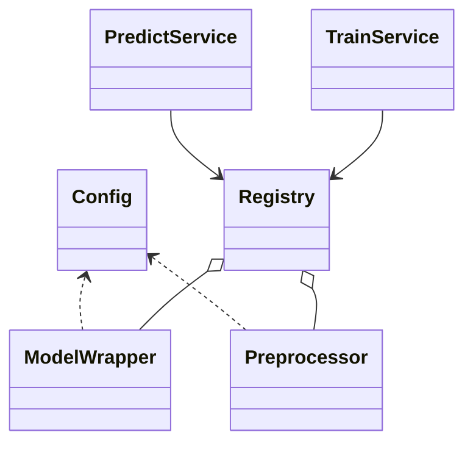
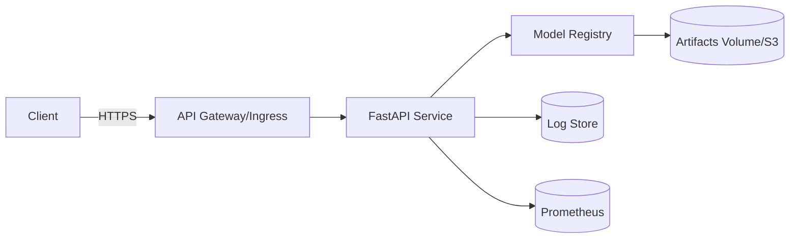

<div align="center">
<h1>🧩 Low-Level Design (LLD) 🧩</h1>
</div>

# **Context**
- [**Context**](#context)
  - [**Project Overview**](#project-overview)
  - [**Version History**](#version-history)
  - [1. **Project Structure**](#1-project-structure)
  - [2. **Key Modules \& Responsibilities**](#2-key-modules--responsibilities)
  - [3. **Visualization: Class Diagram**](#3-visualization-class-diagram)
  - [4. **Data Layer (MongoDB)**](#4-data-layer-mongodb)
  - [5. **Orchestration Sequences**](#5-orchestration-sequences)
  - [6. **Deployment Topology**](#6-deployment-topology)

## **Project Overview**

| Field                  | Details                     |
| ---------------------- | --------------------------- |
| **Project Name**       | US Visa Approval Prediction |
| **Prepared By**        | Md. Alahi Almin Tansen      |
| **Revision Number**    | 1.0                         |
| **Last Revision Date** | 02-09-2025                  |

---
[⬆️ Go to Context](#context)

## **Version History**

| Revision | Date       | Changes Made  | Author                 |
| -------- | ---------- | ------------- | ---------------------- |
| 1.0      | 02-09-2025 | Initial Draft | Md. Alahi Almin Tansen |

---
[⬆️ Go to Context](#context)

## 1. **Project Structure**

```sh
US Visa Approval Prediction/
├── components/      # ML pipeline modules: data ingestion, transformation, validation, trainer, pusher
├── config/          # YAML / JSON configuration files
├── configuration/   # Python config loader
├── constants/       # Global constants
├── data/            # raw / processed / interim datasets
├── entity/          # entities like artifact & config objects
├── logger/          # logging setup
├── notebooks/       # EDA / experimentation
├── pipeline/        # training & prediction pipelines
├── tests/           # unit & integration tests
├── utils/           # helper functions
├── app.py           # demo or API entry point
├── demo.py
├── requirements.txt
├── Dockerfile
└── setup.py
```

---
[⬆️ Go to Context](#context)

## 2. **Key Modules & Responsibilities**

| Module           | Responsibility                                                                            |
| ---------------- | ----------------------------------------------------------------------------------------- |
| `components/`    | ML workflow: ingestion → validation → transformation → training → evaluation → deployment |
| `pipeline/`      | Orchestrates training & prediction steps                                                  |
| `services/`      | High-level APIs: `PredictService`, `TrainService`                                         |
| `configuration/` | Reads environment, config files, paths                                                    |
| `logger/`        | Central logging                                                                           |
| `data/`          | Stores raw/interim/processed data                                                         |

---
[⬆️ Go to Context](#context)

## 3. **Visualization: Class Diagram**



---
[⬆️ Go to Context](#context)

## 4. **Data Layer (MongoDB)**

- **Collections**

  - `applications`: stores raw applications with features & target (`case_status`)
  - `models`: stores model metadata, version, artifact paths, metrics

- **ERD**

  ```mermaid
  erDiagram
  APPLICATIONS {
      int id PK
      varchar continent
      varchar education
      varchar job_experience
      int num_employees
      float prevailing_wage
      int age_of_company
      int applicant_age
      varchar case_status
  }
  MODELS {
      int id PK
      varchar version
      varchar model_path
      varchar preproc_path
      json metrics
  }
  ```

---
[⬆️ Go to Context](#context)

## 5. **Orchestration Sequences**

- **Prediction Flow**

  ```mermaid
  sequenceDiagram
      participant C as Client
      participant API as FastAPI
      participant S as PredictService
      participant R as Registry
      participant M as Model
      participant P as Preprocessor

      C->>API: POST /predict {features}
      API->>S: validate + predict()
      S->>R: get_latest()
      S->>P: transform(df)
      S->>M: predict_proba(X)
      S-->>API: {decision, probability, version}
      API-->>C: 200 JSON
  ```

- **Training Flow**

  ```mermaid
  sequenceDiagram
      participant OPS as CI/Runner
      participant API as FastAPI
      participant T as TrainService
      participant R as Registry

      OPS->>API: POST /train {data_uri, algo}
      API->>T: start pipeline
      T->>T: ingest -> split -> preprocess.fit -> model.train
      T->>R: register(model, preproc, metrics)
      T-->>API: {version, metrics, paths}
  ```

---
[⬆️ Go to Context](#context)

## 6. **Deployment Topology**



---
[⬆️ Go to Context](#context)
